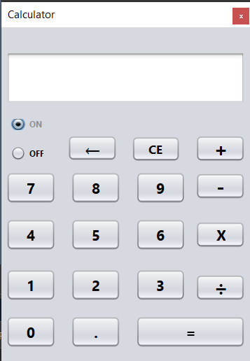

# Calculator
Calculator application created with Java **Swing**. It is simple with easy code to help people understand how a calculator works through codes, and how to create one using java
##
This project is intended to be simple, so the calculator is in a single class to facilitate understanding. It can do the four main calculations, but I didn't add calculations with negative numbers or other types. Feel free to contribute if you think it's important.

## Thank You
Please ⭐️ this repo and share it with others

## Screenshot
|                Java Calculator               
:------------------------------------------------:
  

## Installation 🔌
1. Press the **Fork** button (top right the page) to save copy of this project on your account.

2. Download the repository files (project) from the download section or clone this project by typing in the bash the following command:

       git clone https://github.com/lopesmfelipe/Calculator.git
3. Imported it in Intellij IDEA or any other Java IDE.
4. Run the application :D

## Contributing 💡
If you want to contribute to this project and make it better with new ideas, your pull request is very welcomed.
If you find any issue just put it in the repository issue section, thank you.

